# ESP32-IR-Obstacle-Avoidance-Robot

An embedded robotics project using ESP32 and IR sensors for real-time obstacle detection and autonomous movement, demonstrating sensor interfacing, microcontroller programming, and motor control.

---

## 📖 Introduction

The **IoT-Enabled Autonomous Obstacle Detection Robot** is an advanced embedded systems project powered by the ESP32 microcontroller and infrared sensors to navigate environments autonomously while transmitting real-time operational data to a cloud dashboard.

Built for precision, this project integrates low-level hardware interfacing with IoT connectivity. The onboard ESP32 processes digital signals gathered via IR sensors to execute real-time decision-making, ensuring reliable obstacle detection and avoidance. Simultaneously, telemetry data is published over the internet, allowing remote operators to monitor the robot's status and sensor states live.

### 🎯 Primary Aim
To design, develop, and deploy an intelligent, IoT-enabled mobile robot capable of autonomous obstacle detection and remote monitoring using an ESP32 microcontroller and infrared sensors.

### 🎯 Specific Objectives
- **Hardware Integration:** Interface infrared sensors, motor drivers, and DC motors with the ESP32 microcontroller to build a responsive mobile platform.

---

## 🧰 Components

### 1. ESP32
Acts as the central processing unit and core microcontroller of the robot, providing built-in Wi-Fi and Bluetooth capabilities for executing navigation logic and transmitting IoT telemetry data.

<p align="center">
  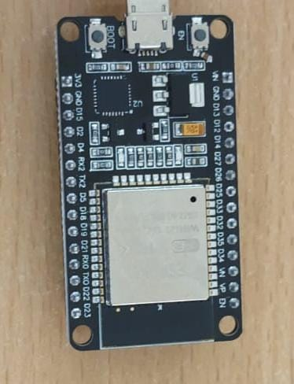
</p>

### 2. L298N Dual H-Bridge Motor Driver
Manages power and directional control for the DC motors, allowing the low-voltage control signals from the ESP32 to safely drive higher-voltage motors.

<p align="center">
  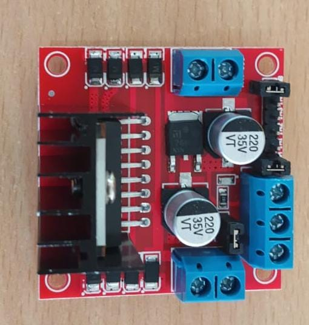
</p>

### 3. DC Motor
Serves as the electromechanical actuators that drive the robot's wheels, converting electrical energy into physical motion for mobility and navigation.

<p align="center">
  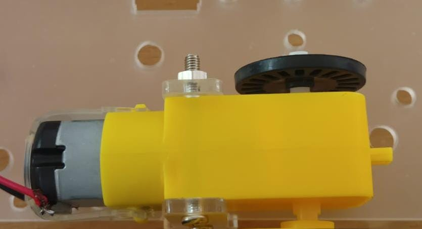
</p>

### 4. Breadboard
Provides a solderless platform for temporarily connecting and wiring electronic components together during prototyping and circuit assembly.

<p align="center">
  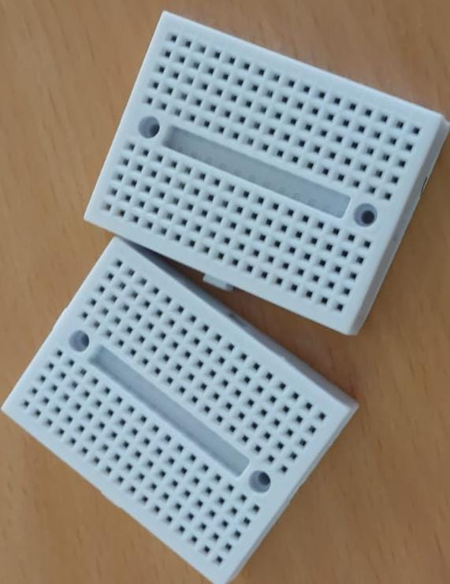
</p>

### 5. IR Sensor
Acts as the proximity detection unit, emitting and receiving infrared light to instantly detect obstacles in the robot's path and send digital signals to the microcontroller.

<p align="center">
  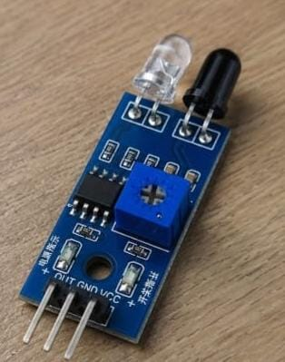
</p>

### 6. Programming Cable (USB Cable)
Facilitates serial communication and firmware flashing, allowing you to upload code from your computer directly to the ESP32 microcontroller.

<p align="center">
  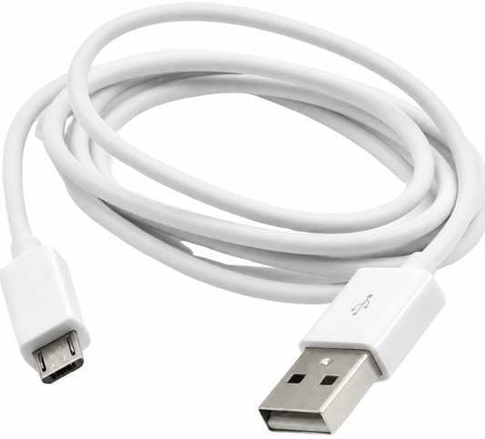
</p>

### 7. Battery Holder
Securely houses the power source and provides organized terminal connections to distribute electrical power safely to the robot's circuitry.

<p align="center">
  
</p>

### 8. 12V Battery
Delivers the necessary electrical power source to drive the motors, motor driver, and overall hardware system efficiently.

<p align="center">
  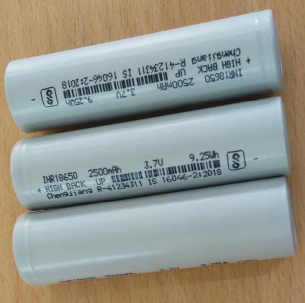
</p>

---

## ⚙️ Working Principle

1. **Power Supply:** A 12V battery powers the L298N motor driver, which supplies regulated power to the ESP32 and IR sensors.
2. **Proximity Detection:** Infrared sensors continuously scan for obstacles and send digital signals to the ESP32 upon detecting an object.
3. **Autonomous Navigation:** The ESP32 processes these sensor signals in real-time and commands the motor driver to steer the DC motors around obstacles.
4. **Cloud Telemetry:** Simultaneously, the ESP32 uses its built-in Wi-Fi to transmit live operational status and sensor data to a remote cloud dashboard.

### Sample Firmware Snippet

```cpp
int IRSensor = 12;

void setup() {
  pinMode(IRSensor, INPUT);
  Serial.begin(115200);
}

void loop() {
  int sensorValue = digitalRead(IRSensor);

  if (sensorValue == HIGH) {
    Serial.println("Obstacle Detected!");
    // Trigger avoidance maneuver
  } else {
    Serial.println("Path Clear");
    // Continue forward
  }
}
```

**IDE used:** Arduino IDE

The images below show the robot's output behavior: on the left, the robot's status when no obstacle is detected in its path; on the right, the robot's status upon detecting an obstacle.

<p align="center">
  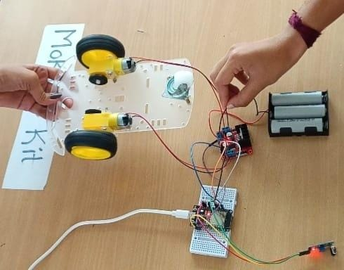
  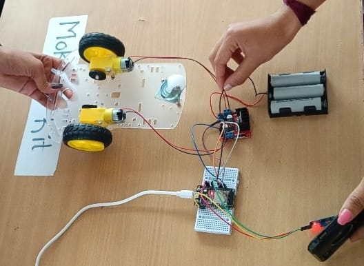
</p>

---

## 🔌 Circuit & Block Diagram

<p align="center">
  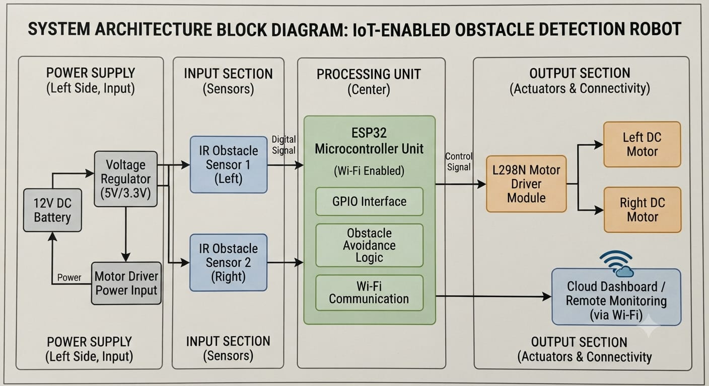
  <br/><i>Block Diagram</i>
</p>

<p align="center">
  
  <br/><i>Circuit Diagram</i>
</p>

<p align="center">
  
  <br/><i>Wiring Connections</i>
</p>

---

## 🛠️ Step-by-Step Building Process

1. **Assemble** the chassis, DC motors, wheels, and battery holder.
2. **Connect** the 12V battery and DC motors to the L298N motor driver.
3. **Mount** the ESP32 and breadboard, then wire the IR sensors and motor driver to the ESP32 GPIO pins.
4. **Upload** the firmware using the programming cable and test the obstacle avoidance and Wi-Fi features.

---

## 🎥 Demo Video

> ⚠️ GitHub doesn't render local `.mp4` files directly in READMEs via relative paths. Click below to watch/download the demo video from the repo:

[](assets/vedio/robo%20vedio.mp4)

*(Click the thumbnail above to open the video file)*

---

## ✅ Advantages

- **Autonomous Operation:** Navigates independently using real-time obstacle detection without manual control.
- **IoT Integration:** Leverages the ESP32 for live remote monitoring and cloud telemetry.
- **Cost-Effective:** Built with affordable and accessible electronic components.

## ⚠️ Disadvantages

- **Lighting Interference:** Ambient light and sunlight can cause false obstacle triggers on IR sensors.
- **Surface Limitations:** Struggles to detect dark or non-reflective materials that absorb infrared beams.
- **Range Constraints:** Limited by short-range proximity detection and local Wi-Fi coverage for cloud features.

---

## 🚀 Applications

- **Smart Surveillance:** Used for automated patrolling and security monitoring in indoor or restricted environments.
- **Industrial Automation:** Serves as a prototype for Automated Guided Vehicles (AGVs) used in smart warehouses for material handling.
- **Educational & Research Labs:** Acts as a practical learning platform for students to understand embedded systems, microcontroller programming, and IoT.

---

## 🐞 Problems & Solutions

| Problem | Solution |
|---------|----------|
| **Ambient Light Interference** — direct sunlight or bright indoor lighting can trigger false IR sensor readings | Calibrate the onboard potentiometers and use physical shrouds around the sensors |
| **Surface Blind Spots** — dark or matte surfaces absorb infrared light instead of reflecting it back | Optimize movement logic with timed sweep patterns to handle non-reflective obstacles |
| **Wi-Fi Range Limits** — telemetry drops when the robot moves outside router coverage | Implement automatic reconnection and data buffering logic within the ESP32 firmware |

---

## 🔮 Future Scope

- **Advanced Sensor Integration:** Incorporating ultrasonic sensors or LiDAR to improve obstacle detection range and handle varying surface textures.
- **AI and Machine Learning:** Integrating a camera module with edge AI processing on the ESP32 for intelligent computer vision and object classification.
- **Extended Connectivity:** Upgrading cloud telemetry to use cellular IoT (such as 4G/LTE or NB-IoT) to remove local Wi-Fi range limitations.

---

## 📌 Conclusion

This project successfully demonstrates the integration of embedded systems and IoT through an autonomous, ESP32-powered obstacle detection robot. By combining real-time local navigation with cloud telemetry, the system achieves efficient automated movement and remote monitoring. Overall, it serves as a cost-effective, scalable foundation for smart automation, industrial AGV prototyping, and educational research.

---

## 🙏 Acknowledgement

This project was developed as part of the **3-Day Workshop on Wheeled Mobile Robotics**, organised by the **Department of Electronics and Communication Engineering (ECE)**, in association with the **IETE Student Forum** and the **Institution's Innovation Council (IIC)**, at **ATME College of Engineering, Mysuru**.

<p align="center">
  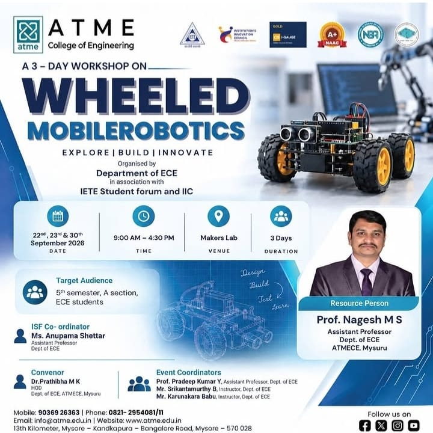
  <br/><i>Workshop Poster</i>
</p>

- **Convenor:** Dr. Prathibha M K, HOD, Dept. of ECE, ATMECE, Mysuru
- **Resource Person:** Prof. Nagesh M S, Assistant Professor, Dept. of ECE, ATMECE, Mysuru
- **ISF Co-ordinator:** Ms. Anupama Shettar, Assistant Professor, Dept. of ECE
- **Event Coordinators:** Prof. Pradeep Kumar Y (Assistant Professor, Dept. of ECE), Mr. Srikantamurthy B (Instructor, Dept. of ECE), Mr. Karunakara Babu (Instructor, Dept. of ECE)

We sincerely thank the organisers, coordinators, and resource person for their guidance and support in making this workshop and project a success.

---

## 👤 Author

**deepthir-eng**
